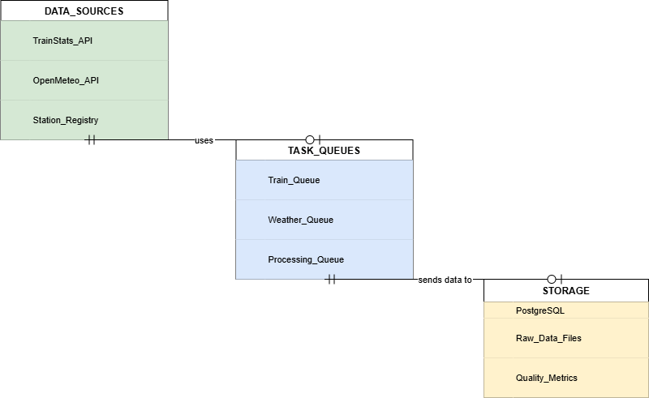
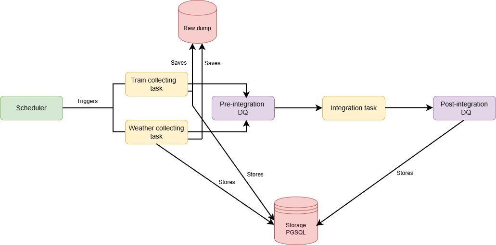
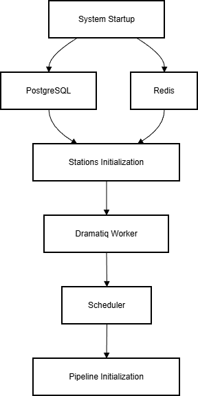

# TrainAnalysis - Railway Weather Correlation System

A comprehensive data pipeline system for analyzing correlations between train delays and weather conditions in the Lombardy region of Italy. This project implements a robust, scalable architecture for collecting, processing, and integrating railway and meteorological data.

## Software Architecture

### System Overview

The TrainAnalysis system is built using a **microservices architecture** with **event-driven processing** using Dramatiq task queues. The system follows a **data lakehouse pattern** with structured data storage and comprehensive data quality management.



### Core Components

#### 1. **Data Ingestion Layer**
- **TrainStats Client**: Collects real-time and archive train data from Italian railway APIs
- **OpenMeteo Client**: Fetches historical and current weather data
- **Station Registry**: Manages railway station metadata with coordinates

#### 2. **Task Processing Layer (Dramatiq)**
- **Train Tasks**: Parallel collection of railway data with retry mechanisms
- **Weather Tasks**: Meteorological data collection with geographic matching
- **Integration Tasks**: Temporal and spatial data fusion
- **Scheduler**: Orchestrates data collection workflows

#### 3. **Data Quality Framework**
- **Unified Processor**: Configurable validation for both train and weather data
- **Schema Validation**: Ensures data structure integrity
- **Business Rules**: Domain-specific validation (delay thresholds, weather ranges)
- **Deduplication**: Intelligent duplicate removal with completeness scoring
- **Metrics Store**: Tracks data quality KPIs and validation results

#### 4. **Data Integration Engine**
- **Temporal Matching**: Aligns train events with weather conditions (±60min window)
- **Spatial Matching**: Links weather data to railway stations by coordinates
- **Feature Engineering**: Creates derived features for analysis
- **Quality Scoring**: Calculates integration success metrics

#### 5. **Storage Layer**
- **PostgreSQL**: Primary data warehouse with optimized schemas
- **File System**: Raw data backup and intermediate processing files
- **Redis**: Barrier backend and caching layer

## Data Flow Pipeline

### Phase 1: Data Collection


### Phase 2: Processing Workflow

1. **Initialization**
   - Scheduler calculates date ranges based on `COLLECTION_DAYS` environment variable
   - Creates processing chunks to manage memory and enable parallel processing
   - Dispatches tasks to appropriate queues

2. **Parallel Data Collection**
   - **Train Data**: Fetches from TrainStats API for all Lombardy stations
   - **Weather Data**: Retrieves meteorological data from OpenMeteo API
   - Both processes include automatic retry logic and error handling

3. **Data Quality Processing**
   - **Schema Validation**: Checks required fields and data types
   - **Timestamp Normalization**: Converts to UTC and rounds weather data to hourly
   - **Deduplication**: Removes duplicates using configurable key fields
   - **Business Rules**: Applies domain-specific validation rules
   - **Quality Metrics**: Tracks validation results and data quality KPIs

4. **Data Integration**
   - **Temporal Alignment**: Matches train events with weather within 60-minute windows
   - **Spatial Matching**: Links data by station coordinates
   - **Feature Engineering**: Creates analytical features (rush hour, weather categories, etc.)
   - **Quality Assessment**: Calculates match rates and integration success metrics

5. **Storage and Monitoring**
   - Stores processed data in PostgreSQL with proper indexing
   - Maintains data quality metrics for monitoring
   - Logs comprehensive processing statistics

### Data Quality Framework

The system implements a comprehensive data quality framework:

#### Train Data Validation
- **Required Fields**: train_id, timestamp, station_code
- **Delay Validation**: Flags extreme delays (>300min) and impossible early arrivals (<-5min)
- **Deduplication**: Keeps records with highest completeness scores
- **Temporal Validation**: Ensures timestamps are within reasonable ranges

#### Weather Data Validation
- **Required Fields**: station_code, timestamp
- **Range Validation**: Temperature (-50°C to +60°C), precipitation (≥0mm)
- **Temporal Rounding**: Rounds to nearest hour for consistency
- **Deduplication**: Keeps most recent records for same station/time

#### Integration Quality
- **Match Rate**: Percentage of train records successfully matched with weather
- **Temporal Accuracy**: Time difference between train and weather observations
- **Completeness**: Percentage of required fields populated
- **Consistency**: Cross-validation between related fields

## Build Instructions

### Prerequisites

- **Docker & Docker Compose**: Container orchestration
- **Git**: Version control
- **8GB+ RAM**: For processing large datasets
- **10GB+ Disk Space**: For data storage and logs

### Quick Start

1. **Clone the Repository**
   ```bash
   git clone <repository-url>
   cd TrainAnalysis
   ```

2. **Build and Start Services**
   ```bash
   # Build all containers
   docker-compose build
   
   # Start the complete system
   docker-compose up -d
   
   # Monitor logs
   docker-compose logs -f
   ```

3. **Verify Installation**
   ```bash
   # Check service status
   docker-compose ps
   
   # Verify database connection
   docker-compose exec postgres psql -U railway_user -d railway_analysis -c "\dt"
   
   # Check station initialization
   docker-compose logs stations-init
   
   # Monitor task processing
   docker-compose logs dramatiq-worker
   ```

### Service Architecture

The system runs the following services:

#### Core Services
- **postgres**: PostgreSQL 15 database with optimized configuration and for task queue management
- **redis**: Redis 7 as a barrier backend storage
- **stations-init**: One-time station data initialization
- **dramatiq-worker**: Multi-process task worker with 2 processes and 4 queues for each process
- **railway-scheduler**: Main orchestration service

#### Service Dependencies


### Configuration Options

#### Environment Variables
```bash
# Database Configuration
POSTGRES_HOST=postgres
POSTGRES_DB=railway_analysis
POSTGRES_USER=railway_user
POSTGRES_PASSWORD=railway_pass

# Processing Configuration
COLLECTION_DAYS=30        # Days of data to collect
CHUNK_SIZE=1             # Processing chunk size (days)

# Barrier Configuration
REDIS_URL=redis://redis:6379
```

#### Docker Compose Customization
```yaml
# It's possible to adjust worker and thread configurations
dramatiq-worker:
  command: >
    dramatiq src.dramatiq_task.train_tasks src.dramatiq_task.weather_tasks 
    src.dramatiq_task.integration_tasks src.dramatiq_task.dramatiq_tasks
    --queues train_queue weather_queue processing_queue default
    --processes 2    # Adjust based on CPU cores
    --threads 4      # Adjust based on memory
    --verbose
```

### Monitoring and Maintenance

#### Log Management
```bash
# View real-time logs
# For viewing real-time logs you can type docker-compose logs -f <service_name>
docker-compose logs -f railway-scheduler
docker-compose logs -f dramatiq-worker

# Check specific service logs
docker-compose logs stations-init
docker-compose logs postgres

# Log files are stored in ./logs/ directory
ls -la logs/
```

#### Database and queue Monitoring 
```bash
# Connect to database
docker-compose exec postgres psql -U railway_user -d railway_analysis

# Check data counts
SELECT 
  (SELECT COUNT(*) FROM stations) as stations,
  (SELECT COUNT(*) FROM trains) as trains,
  (SELECT COUNT(*) FROM weather) as weather,
  (SELECT COUNT(*) FROM train_weather_integrated) as integrated;

# Check recent data
SELECT DATE(timestamp), COUNT(*) 
FROM trains 
GROUP BY DATE(timestamp) 
ORDER BY DATE(timestamp) DESC 
LIMIT 10;

# Check the status of a task and its queue
SELECT * FROM dramatiq.queue
```

#### Performance Tuning
```bash
# Adjust PostgreSQL settings in docker-compose.yml
postgres:
  command: postgres -c max_connections=200 -c shared_buffers=512MB -c effective_cache_size=2GB

# Scale worker processes
docker-compose up -d --scale dramatiq-worker=3
```

### Troubleshooting

#### Common Issues

1. **Database Connection Errors**
   ```bash
   # Check PostgreSQL health
   docker-compose exec postgres pg_isready -U railway_user
   
   # Restart database
   docker-compose restart postgres
   ```

2. **Dramatiq queue does not exist**
   ```bash
   # Check PG connectivity
   docker-compose exec -it postgres pg_isready -U railway_user
   
   # Create queue table  in dramatiq by running
   docker-compose exec postgres psql -U railway_user -d railway_analysis \ -c "
   CREATE SCHEMA IF NOT EXISTS dramatiq;

    DO $$ 
    BEGIN
        IF NOT EXISTS (SELECT 1 FROM pg_type WHERE typname = 'state' AND typnamespace = (SELECT oid FROM pg_namespace WHERE nspname = 'dramatiq')) THEN
            CREATE TYPE dramatiq.state AS ENUM ('queued','consumed','rejected','done');
        END IF;
    END $$;

    CREATE TABLE IF NOT EXISTS dramatiq.queue (
        message_id UUID PRIMARY KEY,
        queue_name TEXT NOT NULL DEFAULT 'default',
        state dramatiq.state,
        mtime TIMESTAMP WITH TIME ZONE DEFAULT (NOW() AT TIME ZONE 'UTC'),
        message JSONB,
        result JSONB,
        result_ttl TIMESTAMP WITH TIME ZONE
    );
    CREATE INDEX IF NOT EXISTS idx_dramatiq_queue_state_mtime ON dramatiq.queue(state, mtime); "
   ```

3. **Memory Issues**
   ```bash
   # Monitor container memory usage
   docker stats
   
   # Reduce chunk size and worker processes
   # Edit CHUNK_SIZE and dramatiq worker configuration
   ```

4. **Data Quality Issues**
   ```bash
   # Check data quality metrics
   docker-compose exec postgres psql -U railway_user -d railway_analysis \
     -c "SELECT * FROM data_quality_metrics ORDER BY timestamp DESC LIMIT 20;"
   ```

### Backup Strategy
```bash
# Database backup
docker-compose exec postgres pg_dump -U railway_user railway_analysis > backup.sql

# Data directory backup
tar -czf data_backup.tar.gz data/ logs/
```

This system provides a robust foundation for analyzing train-weather correlations with enterprise-grade data quality, monitoring, and scalability features.